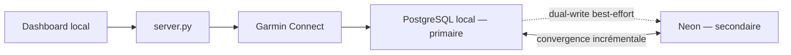
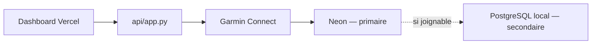

# Garmin Running Dashboard — documentation complète

Cette documentation est la référence technique consolidée du projet.

- Branche unique de travail et de déploiement : `main`
- Objectif sportif : **il n'en existe aucun dans le code.** La course, la date,
  l'objectif chrono et les allures viennent du profil du coureur
  (`runner_profile.py`) — voir « Profil du coureur et génération du plan ».

## Sommaire

1. [Rôle du projet](#rôle-du-projet)
2. [Sources de vérité](#sources-de-vérité)
3. [Architecture](#architecture)
4. [Installation locale](#installation-locale)
5. [Configuration](#configuration)
6. [Synchronisation Garmin, Neon et PostgreSQL local](#synchronisation-garmin-neon-et-postgresql-local)
7. [Données enregistrées](#données-enregistrées)
8. [Authentification et sécurité](#authentification-et-sécurité)
9. [Frontend et PWA](#frontend-et-pwa)
10. [API](#api)
11. [Records et filtre de dénivelé](#records-et-filtre-de-dénivelé)
12. [Plan marathon et ajustements du coach](#plan-marathon-et-ajustements-du-coach)
13. [Chaîne coach automatisée](#chaîne-coach-automatisée)
14. [MCP Coach](#mcp-coach)
15. [Météo des runs](#météo-des-runs)
16. [Scripts d'exploitation](#scripts-dexploitation)
17. [Tests, Git et déploiement](#tests-git-et-déploiement)
18. [Dépannage](#dépannage)
19. [Fichiers à préserver](#fichiers-à-préserver)

## Rôle du projet

Garmin Running Dashboard est un dashboard personnel de course à pied alimenté par Garmin
Connect. La base de données est la source de vérité ; Garmin sert à compléter
les données nouvelles ou manquantes.

Fonctionnalités principales :

- cockpit des dernières semaines ;
- liste et détail des runs ;
- carte GPS, allure, fréquence cardiaque, cadence, altitude et puissance ;
- volume hebdomadaire, mensuel et annuel ;
- charge d'entraînement CTL, ATL et TSB ;
- zones de fréquence cardiaque ;
- VO2max et statut d'entraînement Garmin ;
- records 5 km, 10 km, semi et marathon ;
- équipement et kilométrage des chaussures ;
- plan marathon adaptatif ;
- export d'une séance vers Garmin ;
- coach accessible par MCP et par snapshot JSON.

## Sources de vérité

Il est essentiel de distinguer le code réellement lu par l'application des
documents destinés aux humains.

| Sujet | Source de vérité | Rôle des autres fichiers |
|---|---|---|
| Runs, streams, métriques et matériel | Base PostgreSQL active | Garmin complète le delta |
| Profil du coureur | `runner_profile.py` | Objectif, records, FC max, cadrage du plan, allures dérivées |
| Calendrier marathon de base | `daily_training_plan.py`, fonction `_build_calendar()` | **Généré** depuis le profil ; les Markdown ne pilotent pas le site |
| Ajustements ponctuels du coach | Table `plan_overrides` | Écrits par MCP ou `scripts/ajuster_le_plan.py` |
| Snapshot du coach | `public/coach-journal.json` | Généré depuis le dump SQL local |
| Dump utilisé par la routine coach | `.runtime/local-db/bdd_runs.sql` | Produit par `scripts/export_local_db_sql.sh` |
| Configuration locale | `.env` | Modèle dans `.env.example` |
| Schéma PostgreSQL | `database_pg.py` et migrations | `schema_sqlite.sql` assure la parité SQLite |
| Documentation technique | `documentation.md` | Les anciennes notes de reprise ont été supprimées après consolidation |

Un fichier de plan Markdown (`training-plan.md`, chemin configurable via
`TRAINING_PLAN_FILE`) peut servir de carnet humain — contexte, analyses, météo —
mais le dashboard ne le lit jamais pour construire le calendrier.

## Profil du coureur et génération du plan

**Aucune valeur propre à une personne n'est écrite en dur.** `runner_profile.py`
résout le profil dans cet ordre, du plus fort au plus faible :

1. variables d'environnement (`RUNNER_*`, `PLAN_*`) ;
2. `runner_profile.json` (modèle : `runner_profile.example.json`) ;
3. `.runtime/runner-profile.json` — snapshot écrit par `runner_profile_sync.py`
   à la fin de chaque `garmin_freshness.check_and_populate()`, depuis
   `activity_best_efforts` (mêmes règles que la page Records, filtre de dénivelé
   compris) et la FC max observée sur 90 jours ;
4. replis neutres.

### Des allures, depuis un seul nombre

`derive_paces()` produit les **huit** fourchettes d'entraînement à partir de la
seule allure objectif marathon : Riegel (exposant 1.06) donne les allures de
course sur 3 km, 10 km et semi, puis les écarts d'entraînement usuels donnent le
reste. Vérifié sur un calibrage 3h15 (4:37/km) : seuil 4:15-4:25, VO2
3:52-4:05, facile 5:22-5:45, récupération 5:39-6:07 — à quelques secondes près
les fourchettes qu'un entraîneur pose pour ce niveau.

Sans objectif déclaré, il est projeté depuis le record le plus **long** connu
(le moins optimiste, car il porte déjà de l'endurance spécifique), avec une
marge de conversion de 2,5 %.

### Un calendrier, pas une liste de dates

`_build_calendar()` génère le bloc complet. `PLAN_SHAPE` porte le découpage :

| Phase | Rôle |
|---|---|
| Reprise | Demi-semaine de mise en route, hors numérotation |
| Base | Foncière et premiers rappels de vitesse |
| Spécifique | Seuil, et blocs à allure marathon dans la sortie longue |
| Rodage | Semi test — ce chrono arrête la cible du jour J |
| Affûtage | Le volume tombe, l'allure spécifique reste |

Une semaine sur quatre est une décharge, et la dernière semaine de construction
en est toujours une. La rampe de sortie longue va de `longStartKm` à
`longPeakKm` ; décharges, affûtage et dose d'allure marathon s'en déduisent. Le
gabarit hebdomadaire se construit autour des trois jours choisis dans le profil
(repos, qualité, sortie longue).

Conséquence pour la maintenance : `RACE_DAY`, `PLAN_WEEK_ONE`, `TAPER_START` et
`_phase_for()` dérivent tous du profil. Réintroduire une date absolue dans ce
module recréerait le couplage à un plan unique que le générateur existe pour
supprimer. La suite de tests le vérifie : elle passe sur n'importe quel profil.

```bash
PLAN_WEEKS=12 PLAN_LONG_RUN_WEEKDAY=6 RUNNER_GOAL_TIME=3:45:00 python -m pytest tests/ -q
```

## Architecture

### Stack

- Frontend : React 18, Vite 5, Tailwind CSS et Recharts.
- Backend local : FastAPI et uvicorn dans `server.py`.
- Backend Vercel : fonction Python serverless dans `api/app.py`.
- Base : PostgreSQL avec `pg8000` ; Neon en production et PostgreSQL local sur
  le Mac.
- Mode de développement sans PostgreSQL : SQLite avec `SQLITE_PATH`.
- Auth Garmin : `python-garminconnect`.
- Coach : FastMCP monté sous `/api/mcp`.
- PWA : manifest et service worker dans `public/`.

### Organisation du dépôt

| Chemin | Rôle |
|---|---|
| `src/` | Interface React |
| `src/contexts/ActivityContext.jsx` | Chargement, cache et synchronisation des activités |
| `src/api.js` | Client HTTP du frontend |
| `server.py` | Backend self-hosted et serveur du build `dist/` |
| `api/app.py` | Backend serverless Vercel |
| `database_pg.py` | Accès PostgreSQL, migrations et réplication secondaire |
| `db.py` | Sélection automatique PostgreSQL ou SQLite |
| `db_sqlite.py` | Adaptateur SQLite de développement |
| `garmin_freshness.py` | Connexion Garmin, import et enrichissement des runs |
| `database_convergence.py` | Orchestration de la synchronisation manuelle de toutes les bases |
| `daily_training_plan.py` | Calendrier, adaptation du plan et export de séance |
| `coach_mcp.py` | Outils MCP de lecture et d'ajustement du coach |
| `scripts/` | Démarrage, synchronisation, exports, backfills et routine coach |
| `public/coach-journal.json` | Snapshot coach servi localement et sur Vercel |
| `tests/` | Tests unitaires et tests d'intégration |

### Déploiements

| Environnement | Frontend | Backend | Base primaire | Base secondaire |
|---|---|---|---|---|
| Local Vite | `http://127.0.0.1:5173` | `http://127.0.0.1:8080` | PostgreSQL local | Neon |
| Backend local seul | `http://127.0.0.1:8080` sert `dist/` | même origine | PostgreSQL local | Neon |
| Production | Vercel | `api/app.py` | Neon | PostgreSQL local s'il est joignable |
| SQLite | local | `server.py` | fichier SQLite | aucune réplication |

Sur Vercel, `localhost` désigne le conteneur Vercel et non le Mac. Une
`LOCAL_DATABASE_URL` de production doit donc être une adresse réellement
joignable depuis Internet ou rester vide.

## Installation locale

### Prérequis

- macOS ou Linux ;
- Node.js et npm ;
- Python compatible avec `requirements.txt` ;
- PostgreSQL local, recommandé en version 16 ;
- accès à la base Neon ;
- compte Garmin Connect.

### Installation

```bash
cp .env.example .env
npm install
python3 -m venv .venv
.venv/bin/pip install -r requirements.txt
```

Pour PostgreSQL avec Homebrew :

```bash
brew install postgresql@16
brew services start postgresql@16
createdb strava
```

`scripts/start.sh` sait aussi détecter Homebrew, démarrer PostgreSQL et créer la
base `strava` lorsque c'est possible.

### Démarrage et arrêt

```bash
scripts/start.sh
scripts/start.sh --no-open
scripts/stop.sh
```

Au démarrage, le script :

1. charge `.env` ;
2. vérifie ou prépare l'environnement Python ;
3. détecte PostgreSQL local ;
4. initialise la base locale depuis Neon uniquement si elle est vide ;
5. place PostgreSQL local en primaire et Neon en secondaire ;
6. exporte un dump SQL local ;
7. reconstruit `dist/` si le frontend est plus récent ;
8. lance uvicorn sur le port 8080 ;
9. lance Vite sur le port 5173 ;
10. lance la convergence incrémentale Neon ↔ local en arrière-plan.

### Logs locaux

```text
.runtime/backend.log
.runtime/frontend.log
.runtime/launch.log
```

Les PID sont conservés dans `.runtime/*.pid` et utilisés par `scripts/stop.sh`.

## Configuration

Ne jamais committer `.env` ni une URL de base contenant des identifiants.

| Variable | Défaut | Description |
|---|---|---|
| `SESSION_SECRET` | généré temporairement en local | Signature HMAC des cookies ; obligatoire et stable en production |
| `SESSION_COOKIE` | `garmin_session` | Nom du cookie de session |
| `SESSION_MAX_AGE_SECONDS` | `2592000` | Durée de la session, 30 jours par défaut |
| `BASE_URL` | local ou URL de production | Cookies sécurisés et CORS |
| `ALLOWED_ORIGINS` | vide | Origines CORS supplémentaires séparées par des virgules |
| `DATABASE_URL` | vide | Base primaire active |
| `DATABASE_URL_NEON` | vide | URL Neon, secondaire en local |
| `LOCAL_DATABASE_URL` | vide | PostgreSQL local, primaire en local ou secondaire optionnel sur Vercel |
| `LOCAL_DATABASE_SQL_PATH` | `.runtime/local-db/bdd_runs.sql` | Emplacement du dump coach |
| `SQLITE_PATH` | vide | Active l'adaptateur SQLite |
| `GARMIN_TOKEN_DIR` | `.runtime/garminconnect` en local | Dossier des tokens Garmin ; vide sur Vercel pour lire `sync_meta` |
| `SYNC_INTERVAL` | `900` | Vérification Garmin en arrière-plan, en secondes |
| `DB_CONNECT_TIMEOUT` | `5` | Timeout de connexion à la base primaire |
| `DB_SECONDARY_COOLDOWN` | `120` | Durée d'ouverture du disjoncteur de réplication |
| `SYNC_DB_TIMEOUT` | `120` | Timeout de connexion du script de convergence |
| `MANUAL_SYNC_DB_TIMEOUT` | `10` | Timeout de connexion par base lors d'un clic Synchro |
| `INCREMENTAL_SYNC_DEBOUNCE_SECONDS` | `600` | Anti-rebond de la convergence automatique locale |
| `MCP_AUTH_TOKEN` | vide | Bearer token obligatoire pour le MCP sur Vercel |
| `COACH_SNAPSHOT_URL` | vide | Snapshot distant prioritaire pour le MCP autonome |
| `COACH_SNAPSHOT_PATH` | `public/coach-journal.json` | Snapshot local du coach |
| `COACH_STATIC_BASE_URL` | `BASE_URL` | Origine statique de repli du snapshot |
| `MCP_TRANSPORT` | `http` | Transport `http` ou `stdio` du MCP autonome |
| `MCP_HOST` | `127.0.0.1` | Hôte du MCP autonome |
| `MCP_PORT` | `8765` | Port du MCP autonome |

Configuration minimale locale :

```dotenv
SESSION_SECRET=<secret-long-et-stable>
BASE_URL=http://localhost:8080
LOCAL_DATABASE_URL=postgresql://localhost:5432/strava
DATABASE_URL=postgresql://localhost:5432/strava
DATABASE_URL_NEON=postgresql://<user>:<password>@<host>/<database>?sslmode=require
```

Configuration minimale Vercel :

```dotenv
SESSION_SECRET=<secret-long-et-stable>
BASE_URL=https://<ton-projet>.vercel.app
DATABASE_URL=postgresql://<user>:<password>@<host-neon>/<database>?sslmode=require
MCP_AUTH_TOKEN=<bearer-token>
```

## Synchronisation Garmin, Neon et PostgreSQL local

### Principes

- Une écriture est toujours validée sur la base primaire avant toute
  réplication.
- La réplication vers la base secondaire est best-effort et non fatale.
- Une base secondaire indisponible ne doit jamais annuler une écriture primaire.
- La convergence incrémentale rattrape ultérieurement les écritures manquées.
- Les opérations sont idempotentes et protégées contre les exécutions
  concurrentes.

### Flux local



### Flux Vercel



### Ouverture automatique du dashboard

Après le premier chargement depuis la base active, le frontend appelle
`POST /api/data/freshness-check`. Cette vérification :

1. lit la date du run le plus récent ;
2. interroge Garmin avec un chevauchement de sept jours ;
3. déduplique les runs connus ;
4. ignore les activités présentes dans `sync_tombstones` ;
5. écrit les nouvelles activités et leurs métriques ;
6. rafraîchit VO2max, sommeil, statut d'entraînement et équipement ;
7. retente les détails manquants des runs récents ;
8. en local, programme une convergence Neon ↔ local en arrière-plan.

Le backend self-hosted effectue aussi une vérification Garmin au démarrage,
puis toutes les `SYNC_INTERVAL` secondes.

### Clic manuel sur « Synchro »

Le bouton appelle `POST /api/data/sync`, en local comme sur Vercel.

L'appel attend successivement :

1. la récupération du delta Garmin ;
2. l'écriture sur la base primaire ;
3. les dual-writes vers la secondaire ;
4. la convergence de toutes les bases PostgreSQL configurées et joignables ;
5. le rechargement des données dans l'interface.

La réponse contient `database_sync` avec les bases configurées, les bases
réellement synchronisées et un mode parmi `single_database`, `converged`,
`partial` ou `unconfigured`. En cas de résultat partiel, l'interface avertit
l'utilisateur sans masquer les écritures déjà réussies.

### Dual-write PostgreSQL

`database_pg._replicate()` exécute la même écriture sur la base secondaire après
le commit primaire. Si la secondaire échoue, un disjoncteur suspend les essais
pendant `DB_SECONDARY_COOLDOWN` secondes pour éviter d'ajouter un timeout à
chaque requête.

En local :

- `DATABASE_URL` = PostgreSQL local ;
- `DATABASE_URL_NEON` = Neon ;
- la secondaire choisie est Neon.

Sur Vercel :

- `DATABASE_URL` = Neon ;
- `LOCAL_DATABASE_URL` est optionnelle ;
- la secondaire choisie est la base locale si elle est distincte et joignable.

### Convergence incrémentale

`scripts/sync_neon_local.py` compare Neon et PostgreSQL local dans les deux
sens. Il ne fait pas de miroir complet à chaque lancement.

Pour chaque run en attente, il compare :

- la ligne `activities` et ses marqueurs de composants ;
- `activity_laps` ;
- `activity_splits` ;
- `activity_best_efforts` ;
- `activity_streams` ;
- les composants résumé, zones, météo et santé.

Les petites tables sont aussi fusionnées selon leur clé primaire et leur
`updated_at` :

- `vo2max_history` ;
- `sleep_history` ;
- `shoes` ;
- `bikes` ;
- `sync_meta` ;
- `plan_overrides`.

Les suppressions sont échangées par `sync_tombstones`. Un run supprimé depuis
le dashboard ne doit pas être ressuscité par Garmin lors du passage suivant.

La synchronisation utilise :

- des manifestes et empreintes pour éviter les copies inutiles ;
- des insertions SQL multi-lignes pour limiter les allers-retours ;
- un cache d'introspection du schéma ;
- un verrou consultatif PostgreSQL commun aux runtimes ;
- un PID et un anti-rebond côté serveur local.

### États d'un run

| `sync_status` | Signification |
|---|---|
| `partial` | Run ou composants encore incomplets |
| `ok_local` | Enrichissement terminé sur une primaire locale, convergence finale à faire |
| `ok_neon` | Enrichissement terminé sur une primaire Neon, convergence finale à faire |
| `ok` | Les deux bases convergent ; le run sort des passes suivantes |

### Bootstrap et reconstruction complète

`scripts/mirror_neon_to_local.py` reste utile uniquement pour :

- initialiser une base locale vide avec `--if-empty` ;
- reconstruire volontairement une base locale avec `--full`.

Une reconstruction complète peut écraser le contenu local. Ne jamais lancer
`--full` automatiquement ni sans avoir vérifié la cible.

```bash
python3 scripts/mirror_neon_to_local.py --if-empty
python3 scripts/mirror_neon_to_local.py --full
```

## Données enregistrées

### Activité

La ligne principale conserve notamment :

- identifiants Garmin et identifiants historiques ;
- date locale, durée, distance, vitesse et dénivelé ;
- fréquence cardiaque, cadence, puissance et température ;
- coordonnées de départ et d'arrivée ;
- matériel ;
- charge, effets aérobie et anaérobie, VO2max ;
- dynamique de course ;
- résumé Garmin brut limité aux données utiles du run ;
- météo et snapshot de santé associé.

### Tables enfants

| Table | Contenu |
|---|---|
| `activity_streams` | Points temps, distance, GPS, altitude, FC, cadence, vitesse, puissance et métriques Garmin |
| `activity_laps` | Tours Garmin détaillés |
| `activity_splits` | Splits métriques et kilomètres recalculés |
| `activity_best_efforts` | Meilleurs efforts par distance et dénivelé net |
| Colonnes `activities.hr_time_in_zones` et `activities.power_time_in_zones` | Temps dans les zones FC et puissance |

### Données globales

- `sync_meta` : tokens Garmin, statut d'entraînement et métadonnées ;
- `vo2max_history` : historique VO2max ;
- `sleep_history` : score et durée de sommeil ;
- `shoes` et `bikes` : équipement Garmin et historique ;
- `plan_overrides` : décisions ponctuelles du coach ;
- `sync_tombstones` : suppressions à propager.

### Hydratation à la demande

Les endpoints de streams lisent la base en premier. Si un run n'a pas encore
de streams, le backend peut les demander à Garmin, les normaliser, les stocker
puis répondre au frontend. La carte accepte une polyline résumée ou les points
GPS du stream.

## Authentification et sécurité

- La connexion utilise l'e-mail, le mot de passe et éventuellement le code MFA
  Garmin uniquement pour ouvrir une session Garmin.
- Le mot de passe n'est pas stocké.
- Les tokens Garmin sont enregistrés dans `GARMIN_TOKEN_DIR` en local et dans
  `sync_meta` pour Vercel.
- La session web est un cookie HttpOnly signé avec `SESSION_SECRET`.
- Les endpoints `/api/data/*` et `/api/streams` exigent une session.
- `/api/mcp` exige `Authorization: Bearer <MCP_AUTH_TOKEN>` sur Vercel.
- Les secrets, dumps SQL et fichiers `.runtime` ne doivent jamais être
  committés.
- Les erreurs envoyées au navigateur ne contiennent pas les URL de base.

Pour pousser les tokens Garmin locaux vers Neon :

```bash
.venv/bin/python scripts/garmin_push_neon.py
```

## Frontend et PWA

### Pages actuelles

- `/` : cockpit ;
- `/runs` : liste des runs ;
- `/volume` : volumes ;
- `/performance` : performances ;
- `/progress` : progression et charge ;
- `/training` : entraînement ;
- `/plan` : plan marathon ;
- `/training-zones` : zones ;
- `/gear` : équipement ;
- `/records` : records ;
- `/activity/:id` : détail d'un run.

Les pages secondaires sont chargées dynamiquement. En cas de chunk obsolète
après un déploiement, l'application purge une fois les caches et recharge.

### Chargement progressif

Les activités sont chargées par fenêtres non chevauchantes : 7 jours, 30 jours,
90 jours, un an, puis l'historique plus ancien. Cela évite les réponses trop
volumineuses et les timeouts serverless.

### Service worker

`public/sw.js` applique :

- network-first pour les navigations HTML ;
- cache-first avec rafraîchissement en arrière-plan pour les assets hashés ;
- network-first avec repli hors ligne pour certaines lectures de données ;
- aucune interception des routes d'authentification, de synchronisation, de
  santé et de streams.

Le service worker se désinscrit automatiquement sur les ports Vite 5173 et
5174 pour ne pas figer le développement sur un ancien build.

## API

### Authentification

| Méthode | Route | Rôle |
|---|---|---|
| `POST` | `/api/auth/garmin-login` | Connexion Garmin et MFA |
| `GET` | `/api/auth/me` | Session et profil courant |
| `POST` | `/api/auth/logout` | Déconnexion |
| `POST` | `/api/auth/local-session` | Restauration locale, uniquement sur loopback |

### Données principales

| Méthode | Route | Rôle |
|---|---|---|
| `GET` | `/api/data/activities` | Activités par plage ou pagination |
| `DELETE` | `/api/data/activities/{id}` | Suppression locale avec tombstone |
| `GET` | `/api/data/streams/{id}` | Streams DB-first, Garmin en repli |
| `GET` | `/api/data/prs` | Records calculés |
| `GET` | `/api/data/shoes` | Chaussures |
| `GET` | `/api/data/gear` | Matériel |
| `GET` | `/api/data/vo2max` | Historique VO2max |
| `GET` | `/api/data/training-status` | Statut Garmin |
| `GET` | `/api/data/status` | État du backfill et de la base |
| `GET` | `/api/data/ready` | Sonde de disponibilité DB |

### Synchronisation et plan

| Méthode | Route | Rôle |
|---|---|---|
| `POST` | `/api/data/freshness-check` | Delta Garmin léger à l'ouverture |
| `POST` | `/api/data/sync` | Garmin puis toutes les bases disponibles |
| `GET` | `/api/data/daily-training` | Conseils sur trois jours |
| `POST` | `/api/data/daily-training` | Conseils à partir des runs déjà chargés |
| `GET` | `/api/data/plan-overview` | Vue complète du plan |
| `POST` | `/api/data/workout-garmin` | Envoi de la séance à Garmin |

### Exploitation

| Méthode | Route | Rôle |
|---|---|---|
| `GET` | `/api/health` | Santé du backend |
| `GET` | `/api/setup/status` | État de configuration (`server.py` et Vercel) |
| `POST` | `/api/setup/configure` | Configuration initiale, backend local uniquement |
| `GET` | `/api/coach/journal` | Snapshot coach courant |
| `*` | `/api/mcp/` | Serveur MCP Coach |

Quelques routes de compatibilité restent présentes, notamment
`/api/streams?id=...` et des lectures détaillées Vercel. Elles ne sont pas
utilisées par le frontend actuel et pourront être supprimées séparément après
validation des consommateurs externes.

Chaque appel à `/api/streams`, `/api/data/athlete-zones`, `/api/data/athlete`,
`/api/data/activities/{id}/splits` ou `/api/data/activities/{id}/laps` produit
une ligne structurée préfixée par `[COMPAT-API]` dans les logs du backend local
ou de Vercel. Le statut HTTP, l'environnement, l'origine, le contexte navigateur
et la durée sont enregistrés ; les cookies, tokens, paramètres et identifiants
d'activité ne le sont jamais.

## Records et filtre de dénivelé

Un record ne doit pas être obtenu grâce à une descente anormalement favorable.

La constante unique `database_pg.MAX_NET_DROP_PER_KM` vaut 5 mètres perdus par
kilomètre, soit environ 0,5 % de pente moyenne descendante.

Pour chaque distance cible :

1. `_compute_best_efforts()` examine les fenêtres du stream distance/temps ;
2. il calcule le dénivelé net entre le début et la fin de la fenêtre ;
3. il ignore les fenêtres dépassant la perte autorisée ;
4. il conserve la fenêtre admissible la plus rapide ;
5. il écrit `activity_best_efforts.elevation_delta`.

La lecture par `get_computed_bests_bulk()` applique à nouveau le même filtre.
Une valeur `NULL` signifie que l'altitude est inconnue et conserve le
comportement historique.

Rattrapage historique sans appel Garmin :

```bash
.venv/bin/python scripts/backfill_best_efforts_elevation.py --dry-run
.venv/bin/python scripts/backfill_best_efforts_elevation.py
.venv/bin/python scripts/backfill_best_efforts_elevation.py --activity-id <id>
```

## Plan marathon et ajustements du coach

### Calendrier de base

La vérité du calendrier affiché est `daily_training_plan.py`, fonction
`_build_calendar()`. Modifier un Markdown, un PDF, un message ou un `SKILL.md`
n'a aucun effet sur le dashboard.

### Adaptation automatique

`_reconcile_preview_with_reality()` compare les séances prévues aux runs
réellement enregistrés. Une sortie longue faite en avance peut absorber la
séance future et transformer le jour prévu en récupération. Le cockpit et la
page Plan partagent cette logique.

### Ajustements du coach

La table `plan_overrides` est le seul canal d'ajustement sans redéploiement.
L'ordre de priorité est :

1. override du coach ;
2. adaptation automatique à la réalité ;
3. calendrier codé dans `_build_calendar()`.

Un ajustement écrit dans un `SKILL.md`, un Markdown ou une conversation reste
invisible tant qu'il n'est pas écrit dans `plan_overrides`.

Commandes CLI :

```bash
.venv/bin/python scripts/ajuster_le_plan.py lister
.venv/bin/python scripts/ajuster_le_plan.py set \
  --jour 2026-08-01 --categorie rest --note "Randonnée"
.venv/bin/python scripts/ajuster_le_plan.py set \
  --jour 2026-07-30 --categorie easy \
  --titre "Footing récup" --contenu "40 min très facile"
.venv/bin/python scripts/ajuster_le_plan.py annuler --jour 2026-08-01
```

Catégories : `easy`, `quality`, `long`, `rest`, `race`. Pour `rest`, le titre et
le contenu sont optionnels ; pour les autres catégories, ils sont obligatoires.

Les outils MCP équivalents sont `ajuster_le_plan`,
`annuler_ajustement_plan` et `ajustements_du_plan`.

## Chaîne coach automatisée

La routine coach s'appuie sur les fichiers suivants :

```text
scripts/sync_neon_local.py
scripts/export_local_db_sql.sh
.runtime/local-db/bdd_runs.sql
scripts/coach_journal.py
public/coach-journal.json
scripts/ajuster_le_plan.py
daily_training_plan.py
scripts/daily_plan_update.sh
```

### Mise à jour quotidienne simple

`scripts/daily_plan_update.sh` :

1. charge `.env` ;
2. converge Neon et PostgreSQL local ;
3. exporte la base locale en SQL ;
4. analyse les runs des trois derniers jours ;
5. indique que la séance calculée est disponible dans le dashboard.

```bash
scripts/daily_plan_update.sh
```

### Publication du journal coach

`scripts/coach_publish.sh` :

1. régénère le dump SQL local ;
2. produit `.runtime/journal-coach.md` ;
3. produit `public/coach-journal.json` ;
4. copie les deux fichiers vers iCloud Drive ;
5. avec `--push`, committe le snapshot JSON et pousse la branche courante.

```bash
scripts/coach_publish.sh
scripts/coach_publish.sh --push
```

L'option `--push` ne doit être utilisée que depuis `main`, conformément aux
règles Git du projet.

### Ce que lit le coach

Le coach n'appelle pas les routes HTTP de détail du dashboard. Sa chaîne locale
lit le dump SQL et utilise `scripts/ajuster_le_plan.py` pour écrire les décisions
dans la base. Il faut donc préserver le schéma du dump et les scripts listés
ci-dessus.

## MCP Coach

Le même MCP est disponible sous trois formes :

| Mode | URL |
|---|---|
| Backend local | `http://127.0.0.1:8080/api/mcp/` |
| Serveur autonome | `http://127.0.0.1:8765/mcp/` |
| Vercel | `https://<ton-projet>.vercel.app/api/mcp/` |

Lancement autonome :

```bash
python3 scripts/coach_mcp_server.py
MCP_TRANSPORT=stdio python3 scripts/coach_mcp_server.py
```

Outils principaux :

| Outil | Rôle |
|---|---|
| `journal_du_jour` | Snapshot complet du journal |
| `entrainement_a_faire` / `seance_du_jour` | Séance recommandée |
| `analyse_runs_precedents` | Analyse des derniers runs |
| `sept_derniers_runs` | Vue des sept derniers runs |
| `projection` | Projection de performance |
| `zones_allure` | Zones d'allure |
| `poser_question_coach` | Routage d'une question naturelle |
| `ajustements_du_plan` | Liste des overrides actifs |
| `ajuster_le_plan` | Création ou remplacement d'un override |
| `annuler_ajustement_plan` | Suppression d'un override |

Sur Vercel :

```text
Authorization: Bearer <MCP_AUTH_TOKEN>
```

Le chargement du snapshot essaie successivement l'URL configurée, le fichier
local puis l'asset statique Vercel.

## Météo des runs

La météo Open-Meteo est enregistrée sur l'activité et répliquée avec elle. Elle
utilise les coordonnées de départ, l'heure réelle et le fuseau Europe/Paris.

- Forecast pour un run récent ;
- archive historique au-delà de cinq jours ;
- rattrapage automatique lors des vérifications Garmin ;
- fallback frontend si la météo n'est pas encore en base.

Lors de chaque analyse de run ou mise à jour du document marathon :

```bash
.venv/bin/python scripts/weather_for_run.py --update-plan
```

Autres usages :

```bash
.venv/bin/python scripts/weather_for_run.py
.venv/bin/python scripts/weather_for_run.py --json
.venv/bin/python scripts/weather_for_run.py --activity-id <id>
.venv/bin/python scripts/backfill_weather.py --status
```

## Scripts d'exploitation

### Démarrage et données

| Script | Usage |
|---|---|
| `scripts/start.sh` | Démarre backend, frontend et synchronisation |
| `scripts/stop.sh` | Arrête les processus locaux |
| `scripts/sync_neon_local.py` | Convergence incrémentale bidirectionnelle |
| `scripts/mirror_neon_to_local.py` | Bootstrap ou reconstruction complète locale |
| `scripts/export_local_db_sql.sh` | Produit le dump PostgreSQL du coach |
| `scripts/import_local_db_sql.sh` | Restaure un dump SQL local |
| `scripts/import_fit.py` | Import manuel d'un fichier FIT |

### Garmin

| Script | Usage |
|---|---|
| `scripts/garmin_setup.py` | Configuration interactive Garmin |
| `scripts/garmin_browser_login.py` | Connexion compatible avec l'ancien flux, basée sur `garminconnect` |
| `scripts/garmin_push_neon.py` | Copie des tokens locaux vers Neon |
| `scripts/backfill_garmin_run_metrics.py` | Enrichissement des métriques Garmin historiques |
| `scripts/backfill_garmin_health.py` | Snapshot sommeil, HRV et FC de repos par run |
| `scripts/backfill_sleep_history.py` | Historique de sommeil |
| `scripts/backfill_vo2max_history.py` | Historique VO2max |

### Analyse et coach

| Script | Usage |
|---|---|
| `scripts/coach_journal.py` | Génère le journal et le snapshot coach |
| `scripts/coach_publish.sh` | Pipeline journal + iCloud + push optionnel |
| `scripts/daily_plan_update.sh` | Convergence, dump et analyse quotidienne |
| `scripts/ajuster_le_plan.py` | Écrit les overrides du coach |
| `scripts/coach_mcp_server.py` | MCP local autonome |
| `scripts/detect_reps.py` | Détection de répétitions depuis les streams |
| `scripts/weather_for_run.py` | Météo d'un run et mise à jour du document marathon |

### Backfills : règle générale

Toujours commencer par un mode `--dry-run`, `--status`, une activité précise ou
une petite limite lorsque le script le permet. Vérifier la base cible avant
toute écriture massive.

## Tests, Git et déploiement

### Tests

Suite complète :

```bash
.venv/bin/python -m unittest discover -s tests -p 'test_*.py'
```

Build frontend :

```bash
npm run build
```

Vérifications complémentaires :

```bash
git diff --check
.venv/bin/python -m py_compile server.py api/app.py database_pg.py garmin_freshness.py
curl -fsS http://127.0.0.1:8080/api/health
```

Les tests PostgreSQL d'intégration peuvent nécessiter des bases de test ou être
ignorés automatiquement selon l'environnement.

### Règles Git

- Toujours travailler sur `main`.
- Ne jamais créer ou pousser de branche `claude/*`.
- Ne jamais pousser avec `--force`.
- Ne jamais contourner les hooks avec `--no-verify` sans demande explicite.
- Ne pas créer de pull request sans demande explicite.
- Demander avant de commit si l'utilisateur ne l'a pas autorisé.

Workflow après modification :

```bash
npm run build                         # si src/ ou public/ change
scripts/stop.sh && scripts/start.sh --no-open
.venv/bin/python -m unittest discover -s tests -p 'test_*.py'
git add -A
git commit -m "Description concise"
git push origin main
```

### Vercel

Vercel construit automatiquement `main` :

- commande : `npm run build` ;
- dossier statique : `dist` ;
- fonction Python : `api/app.py` ;
- durée maximale configurée : 120 secondes ;
- les routes `/api/*` sont réécrites vers la fonction Python ;
- les autres routes reviennent vers `index.html` pour React Router.

Après un push, vérifier :

```bash
curl -fsS https://<ton-projet>.vercel.app/api/health
```

## Dépannage

### Le backend local ne répond pas

```bash
scripts/stop.sh
scripts/start.sh --no-open
tail -n 100 .runtime/backend.log
tail -n 100 .runtime/launch.log
```

Vérifier également le port :

```bash
lsof -nP -iTCP:8080 -sTCP:LISTEN
```

### Le frontend ne montre pas le dernier code

- Sur le port 5173, vérifier `.runtime/frontend.log`.
- Sur le port 8080, exécuter `npm run build` puis redémarrer.
- Sur mobile, vider le cache depuis le bouton prévu dans l'interface.
- Vérifier que le service worker a reçu la dernière version.

### Neon est indisponible

- Le dashboard local continue sur PostgreSQL local.
- Les écritures primaires restent valides.
- Le disjoncteur évite les tentatives répétées.
- La convergence reprendra au prochain démarrage, à la prochaine ouverture
  locale ou au prochain clic Synchro.

### PostgreSQL local est indisponible

- `scripts/start.sh` tente de le démarrer avec Homebrew.
- Si la base locale n'est pas exploitable mais Neon est configurée, le backend
  reste sur Neon comme primaire.
- Sur Vercel, la synchronisation est annoncée partielle mais Neon reste valide.

### Un run manque

1. cliquer sur Synchro ;
2. vérifier la session Garmin ;
3. lire les logs `[GARMIN]` et `[SYNC-ALL]` ;
4. vérifier qu'il n'existe pas de tombstone volontaire ;
5. vérifier la date du dernier run et les identifiants Garmin ;
6. retenter l'hydratation des streams depuis le détail du run.

### Un run supprimé revient

Vérifier `sync_tombstones` sur les deux bases. Le filtre accepte l'identifiant
canonique et `garmin_activity_id`. Une convergence doit propager le tombstone
avant la prochaine importation.

### Le plan n'affiche pas une décision du coach

Le texte d'un Markdown ou d'un message ne suffit pas. Vérifier :

```bash
.venv/bin/python scripts/ajuster_le_plan.py lister
```

Si l'ajustement n'apparaît pas, l'écrire avec le CLI ou l'outil MCP puis
recharger le plan.

### Une synchronisation complète est longue

La première convergence historique peut examiner de nombreux runs et streams.
Ne pas tuer le processus sauf nécessité : les écritures sont idempotentes, mais
les runs ne reçoivent l'état final `ok` qu'après validation de la convergence.
Les passages suivants deviennent légers.

## Fichiers à préserver

La routine coach dépend directement ou indirectement de :

- `daily_training_plan.py` ;
- `database_pg.py`, `db.py` et le schéma des tables ;
- `scripts/sync_neon_local.py` ;
- `scripts/export_local_db_sql.sh` ;
- `scripts/ajuster_le_plan.py` ;
- `scripts/daily_plan_update.sh` ;
- `scripts/coach_journal.py` ;
- `.runtime/local-db/bdd_runs.sql` ;
- `public/coach-journal.json`.

Ne pas confondre `daily_training_plan.py`, situé à la racine et utilisé par le
site, avec un éventuel document ou script de même thème.

Les fichiers suivants sont des artefacts humains ou téléchargeables, pas des
sources de calcul du dashboard :

- `training-plan.md` (carnet humain, chemin via `TRAINING_PLAN_FILE`) ;
- `.runtime/journal-coach.md`.

Ils peuvent être mis à jour ou archivés sans modifier le calendrier codé, mais
leur contenu reste utile à la lecture humaine.

`public/training-plan.pdf` fait exception : il est **généré** par
`scripts/export_plan_pdf.py` depuis `build_plan_overview()` et
`runner_profile.PROFILE`, donc il ne se modifie pas à la main. Un document
proposé au téléchargement depuis le Cockpit qui contredit la page Plan est pire
que pas de document. Le régénérer après toute modification du calendrier ou du
profil :

```bash
.venv/bin/python scripts/export_plan_pdf.py
```

`reportlab` n'est volontairement pas dans `requirements.txt` : l'outil tourne
hors ligne et n'a pas à alourdir la fonction serverless Vercel. `pip install
reportlab` suffit ; les tests de rendu se sautent proprement s'il est absent.
